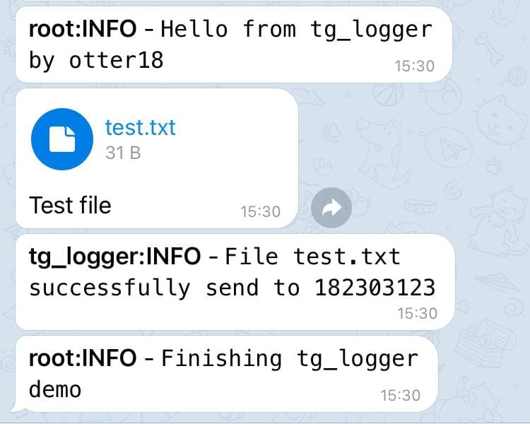

# tg_logger tool
bridging python logging and user files to tg bot
## Example

```python
#  Copyright (c) ChernV (@otter18), 2021.

import logging

from tg_logger import __init__

# Telegram data
token = "1234567890:AAAAAAAAAAAAAAAAAAAAAAAAAAAAAAAAAAA"
users = [1111111111]

# Logging format
logging.basicConfig(format='%(asctime)s:%(name)s:%(levelname)s - %(message)s')
formatter = logging.Formatter('<b>%(name)s:%(levelname)s</b> - <code>%(message)s</code>')

# Setup TgLoggerHandler
tg_handler = __init__.TgLoggerHandler(
    token=token,  # tg bot token
    users=users,  # list of user_id
    timeout=10  # default value is 10 seconds
)
tg_handler.setFormatter(formatter)
logger = logging.getLogger()
logger.setLevel(logging.INFO)
logger.addHandler(tg_handler)

# Test
logger.info("Hello from tg_logger by otter18")

# TgFileLogger example
tg_files_logger = __init__.TgFileLogger(
    token=token,  # tg bot token
    users=users,  # list of user_id
    timeout=10  # default is 10 seconds
)

file_name = "test.txt"
with open(file_name, 'w') as example_file:
    example_file.write("Hello from tg_logger by otter18")

tg_files_logger.send(file_name, "Test file")

# And one more time...
logger.info("Finishing tg_logger demo")

```
## Result

